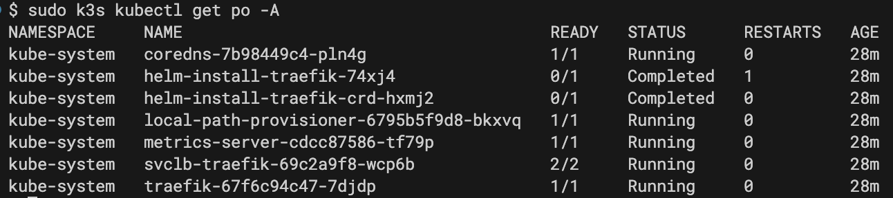
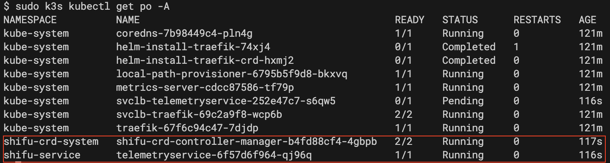
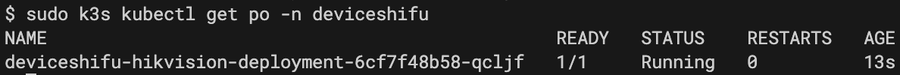
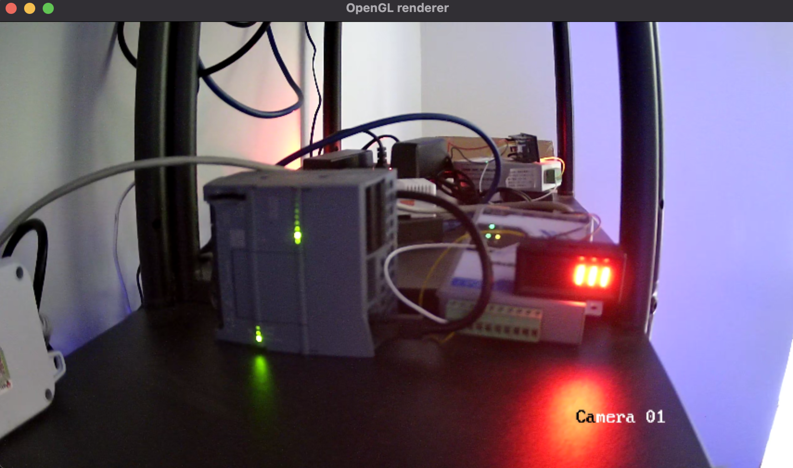
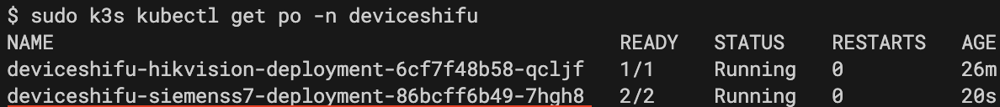
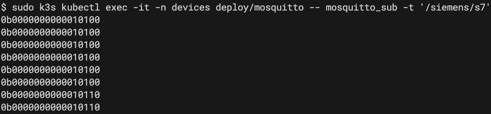

# Shifu GStreamer Demo

## Requirements

1. A Linux distribution capable of [installing K3s](https://docs.k3s.io/quick-start#install-script)
   - View K3s' hardware and software requirements [here](https://docs.k3s.io/installation/requirements)

2. GStreamer installed on your **client**
   - [Installation documentation](https://gstreamer.freedesktop.org/documentation/installing/?gi-language=c)

## Steps

### Setup K3s Cluster

#### Installation

On your Linux machine, install K3s using the following command:

```bash
curl -sfL https://get.k3s.io | sh -
```

If the cluster is running, you should see the following output after running:

```bash
sudo k3s kubectl get po -A
```



#### Troubleshooting

If you encounter issues with K3s not booting up on Ubuntu 21.10 to Ubuntu 23.10 running on ARM:

1. Check the logs:

   ```bash
   journalctl -xe -u k3s
   ```

2. If the error is related to `VXLAN`, try installing the following package:

   ```bash
   sudo apt install linux-modules-extra-raspi
   ```

#### Additional Information

For more details on installation requirements, particularly for Raspberry Pi, refer to the [K3s official documentation](https://docs.k3s.io/installation/requirements?os=pi#operating-systems).

### Install Shifu and Shifu-related Services

#### Install Shifu and TelemetryService

```bash
sudo k3s kubectl apply -f https://raw.githubusercontent.com/Edgenesis/shifu/v0.53.0/pkg/k8s/crd/install/shifu_install.yml
sudo k3s kubectl apply -f https://raw.githubusercontent.com/Edgenesis/shifu/v0.53.0/pkg/telemetryservice/install/telemetryservice_install.yaml
```

The following services should be running as shown below:


### Use GStreamer to Stream Video from an IP Camera

#### Update TCP deviceShifu Configuration

Update the `camera/camera_edgedevice.yaml` file's `spec.address` with the correct RTSP URL (e.g., "192.168.10.20").

#### Deploy TCP deviceShifu

```bash
sudo k3s kubectl apply -f camera/
```

deviceShifu should be running as shown below:


#### Port Forward the Service

To access the camera stream from outside the cluster:

```bash
sudo k3s kubectl port-forward -n deviceshifu svc/deviceshifu-camera 30080: --address=0.0.0.0
```

#### Access the Camera Stream with GStreamer

From your **client**, issue the following command (replace placeholders with your RTSP username, password, and server IP address):

```bash
gst-launch-1.0 rtspsrc location="rtsp://{RTSP_USERNAME}:{RTSP_PASSWORD}@{SERVER_IP_ADDRESS}:30080" \
    protocols=tcp \
    retry=5 \
    latency=2000 \
    timeout=60000000 \
    ! rtph265depay ! h265parse ! avdec_h265 \
    ! videoconvert ! autovideosink
```

Sample output from an IP camera stream:


### Siemens PLC deviceShifu

#### Update Siemens PLC deviceShifu Configuration

In the `plc/deployment.yaml` file, update:

- `spec.template.spec.containers[1].env`'s `PLC_ADDRESS` with the correct PLC IP address
- `PLC_PORT` with the correct PLC port

#### Deploy Siemens PLC deviceShifu

```bash
sudo k3s kubectl apply -f plc/
```

deviceShifu should be running as shown below:


#### Deploy Ingress for the Siemens PLC deviceShifu

```bash
sudo k3s kubectl apply -f ingress/ingress-plc.yaml
```

#### Control the Siemens PLC deviceShifu

Use `curl` to control the Siemens PLC deviceShifu. For example, to change the output of Q0.1 and Q0.2 to 1 and 0:

```bash
curl "localhost/api/sendsinglebit?rootaddress=Q&address=0&start=0&digit=1&value=1"; echo
curl "localhost/api/sendsinglebit?rootaddress=Q&address=0&start=0&digit=1&value=0"; echo
curl "localhost/api/sendsinglebit?rootaddress=Q&address=0&start=0&digit=2&value=1"; echo
curl "localhost/api/sendsinglebit?rootaddress=Q&address=0&start=0&digit=2&value=0"; echo
```

### Push Data from the Siemens PLC to an MQTT Broker

#### Deploy MQTT Broker and TelemetryService for the Siemens PLC deviceShifu

```bash
sudo k3s kubectl apply -f https://raw.githubusercontent.com/Edgenesis/shifu/main/examples/mqttDeviceShifu/mqtt_broker/mosquitto.yaml
sudo k3s kubectl apply -f telemetryservice/telemetryserivce-plc.yaml
```

#### Subscribe to the MQTT Broker

To view the data:

```bash
sudo k3s kubectl exec -it -n devices deploy/mosquitto -- mosquitto_sub -t '/siemens/s7'
```

Sample output from the MQTT Broker:


## Shifu Cloud

### Deploy Camera deviceShifu from Shifu Cloud

Follow the instructions in the [Shifu Cloud documentation](https://docs.cloud.shifu.dev/docs/how-to/device/templates/ip-camera-template) to deploy the camera deviceShifu.

## Contact

For any questions or issues, please contact the Shifu team at [info@edgenesis.com](mailto:info@edgenesis.com).
